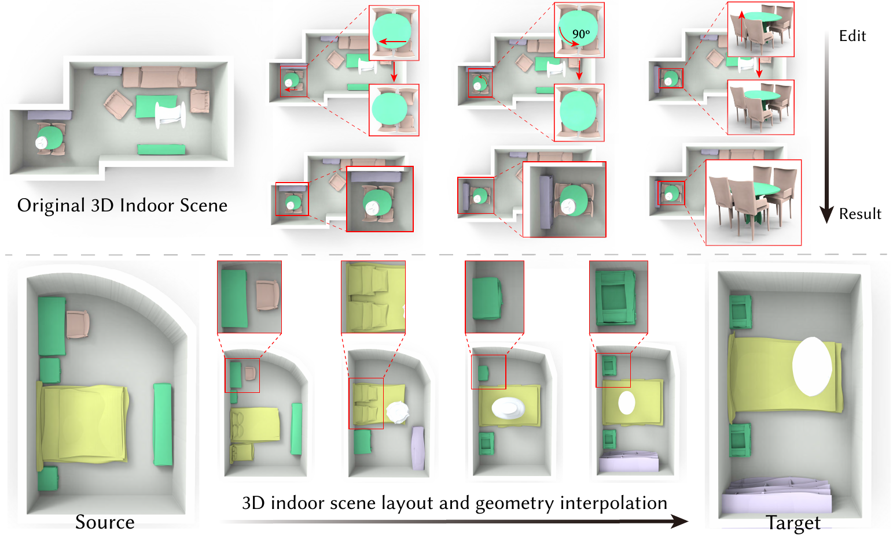

# SceneHGN
The code of "[TPAMI] SceneHGN: Hierarchical Graph Networks for 3D Indoor Scene Generation with Fine-Grained Geometry"


**Figure 1.** Our deep generative model SCENEHGN encodes the indoor scene across multiple conceptual levels: the room, functional regions, furniture objects, and even fine-grained object part geometry. We utilize edges, including our proposed hyper-edges to strengthen the relations between objects during decoding. This enables some interesting applications, such as room editing with part-level geometry and scene interpolation. Our approach allows the entire 3D room to be represented and synthesized. Based on this, we can achieve part geometry editing (at different scales) in the scene, such as rigid transformation in a functional region and non-rigid deformation at the part level. Meanwhile, our network is capable of capturing the smooth latent space near similar scenes for plausible scene interpolation.


## Introduction 
We propose SCENEHGN, a hierarchical graph network for 3D indoor scenes that takes into account the full hierarchy from the room level to the object level, then finally to the object part level. Therefore for the first time, our method is able to directly generate plausible 3D room content, including furniture objects with fine-grained geometry, and their layout.


## About the paper

Our team: 
[Lin Gao](http://people.geometrylearning.com/lin/),
[Jia-Mu Sun](http://www.jmsun.work/),
[Kaichun Mo](https://cs.stanford.edu/~kaichun),
[Yu-Kun Lai](http://users.cs.cf.ac.uk/Yukun.Lai/),
[Leonidas J. Guibas](https://geometry.stanford.edu/member/guibas/)
and [Jie Yang](http://people.geometrylearning.com/~jieyang/)
from 
Institute of Computing Technology, CAS and University of Chinese Academy of Sciences, Stanford University, Cardiff University.

**Published on IEEE Transactions on Pattern Analysis and Machine Intelligence**

Arxiv Version: https://arxiv.org/abs/2302.10237

Project Page: http://geometrylearning.com/scenehgn/


## About this repository

This repository provides data and code as follows.

```
comming soon
```

## License

MIT Licence


## Citation
```
@article{gao2023scenehgn,
  title={SceneHGN: Hierarchical Graph Networks for 3D Indoor Scene Generation with Fine-Grained Geometry},
  author={Gao, Lin and Sun, Jia-Mu and Mo, Kaichun and Lai, Yu-Kun and Guibas, Leonidas J and Yang, Jie},
  journal={IEEE Transactions on Pattern Analysis and Machine Intelligence},
  year={2023},
  publisher={IEEE}
}
```
